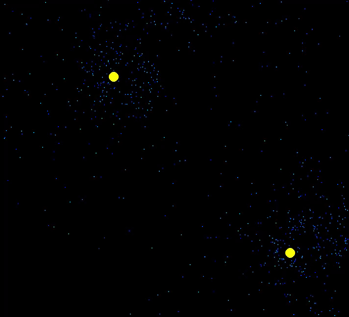

<h1 align="center" style="font-size: 50px;">Quadtree Generation Library</h1>
<p1>
The primary intention of this library is to create a launching off point for other projects of mine, its capable of creating the "Quadtree" data structure, effectively born of a tree which subdivides in order to create branches. With this in place, future projects such as my rendition of the Barnes-Hut simulation will be much more streamlined.</p1>
  
https://en.wikipedia.org/wiki/Quadtree
  

  

  

<p2>Above you can see the visual representation of utilizing this library, it takes a 2d coordinate plane and then subdivides from the base quadrants through a recursive structure. This visual representation has been slowed down significantly for visual understanding. The conditions on this are that whenever a subquadrant contains more than three points, it will self divide until there are less than three within the region.  </p2>

<s>All current updates to the Barnes-Hut simulation will take place on the master branch, a merge will occur when the results are stable</s>
This is no longer the case, all changes have been merged into the main Branch

<h2 align="center" style="font-size: 50px;"> The Barnes-Hut Simulation </h2>
<p3> The Barnes Hut simulation, is a classical approach originally developed in 1986 to the N-body problem utilizing a quadtree to circumvent the O(N^2) cost of a traditional "Bruteforce" N-body simulation. The Barnes-Hut method changes the upperbound in operation time to O(n log n) allowing for many more planets to be represented within the program, with a minor effect on overall accuracy</p3>
 https://en.wikipedia.org/wiki/Barnes%E2%80%93Hut_simulation 

  

